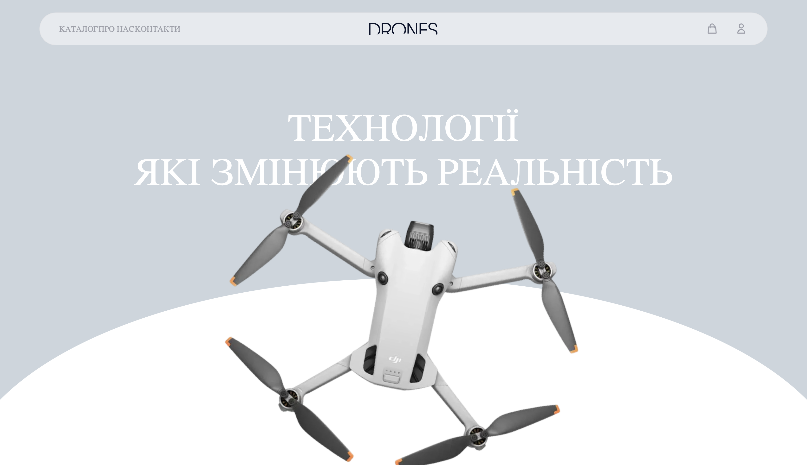

# 🛸 DroneShop — Інтернет-магазин дронів на Flask

Це вебзастосунок для онлайн-магазину дронів, створений з використанням мікрофреймворку [Flask](https://flask.palletsprojects.com/). Проєкт демонструє створення повноцінного магазину: каталог товарів, кошик, реєстрацію користувачів, оформлення замовлення та панель адміністратора.



---

## 🧰 Технології

- Flask
- Jinja2 Templates
- Flask-Login, Flask-SQLAlchemy
- SQLite 
- dotenv

---

## 📂 Структура

- `/home` — головна сторінка
- `/shop` — перегляд дронів
- `/cart` — додавання до кошика
- `/user` — вхід/реєстрація
- `.env` — змінні середовища

---

## 🧪 Запуск проєкту

1. Клонувати репозиторій:
```bash
git clone https://github.com/SaberWQ/ShopDrones.git
cd DroneShop
````

2. Створити віртуальне середовище:

```bash
python -m venv venv
source venv/bin/activate  # або venv\Scripts\activate на Windows
```

3. Встановити залежності:

```bash
pip install -r requirements.txt
```

4. Заповнити `.env`:

```env
FLASK_APP=app.py
FLASK_ENV=development
SECRET_KEY=your_secret_key
```

5. Ініціалізувати базу:

```bash
flask shell
>>> from app import db
>>> db.create_all()
>>> exit()
```

6. Запустити сервер:

```bash
flask run
```

---

## 📸 Скріншоти

> *(приклади — додай свої файли або заміни шляхи)*


*Сторінка каталогу товарів із фільтрами*

---

## 📘 Корисні ресурси

* [Офіційна документація Flask](https://flask.palletsprojects.com/)
* [Flask Mega-Tutorial by Miguel Grinberg](https://blog.miguelgrinberg.com/post/the-flask-mega-tutorial-part-i-hello-world)
* [Jinja2 шаблони](https://jinja.palletsprojects.com/)
* [Flask-WTF Forms](https://flask-wtf.readthedocs.io/en/stable/)
* [SQLAlchemy ORM](https://docs.sqlalchemy.org/)
* [Bootstrap 5](https://getbootstrap.com/)

---

## ✅ Висновок

Цей проєкт ідеально підходить для ознайомлення з основами веброзробки на Flask. Він охоплює основні аспекти створення інтернет-магазину: роботу з базою даних, формами, шаблонами, аутентифікацію та захист даних.

Проєкт легко адаптувати до будь-якої ніші — від електроніки до книжкових магазинів. Може використовуватись як стартова точка для комерційного MVP.

---

## 👨‍💻 Автор

* [SaberWQ](https://github.com/SaberWQ)

